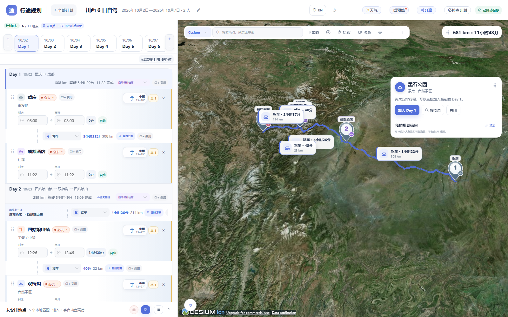

# 互动式旅行路线规划器

## 界面预览

以下截图来自使用仓库中的完整迁移计划实际恢复后运行的当前版本，不是静态设计稿：

<p align="center">
  
</p>

| 恢复后的计划首页 | 恢复后的真实行程与地图 |
|---|---|
|  |  |
## 技术栈

- Vue 3
- TypeScript
- Vite
- Pinia
- Element Plus 2.14.5 + PrimeIcons
- OpenAI JavaScript SDK 7.15.0
- Anthropic TypeScript SDK 0.125.0
- 基于 Element Plus CSS Variables 的自定义旅行主题
- 高德地图 JavaScript API 2.0
- Vitest
- Playwright
- pnpm 12.4.0

## 启动

```powershell
pnpm install --frozen-lockfile
pnpm dev
```

访问：

```text
http://127.0.0.1:8765/
```

开发端口固定为 `8765`，与当前高德 Web Key 的本地域名配置保持一致。
## 桌面版下载

桌面版由 GitHub Actions 自动构建并发布到 [GitHub Releases](https://github.com/pedoc/interactive-travel-planner/releases/latest)。当前工作流提供：

- Windows x64：`.msi` / `.exe`；
- macOS arm64：`.dmg`；
- macOS x64：`.dmg`；
- Linux x64：`.AppImage` / `.deb`。

发布新版本时创建并推送形如 `v0.1.0` 的 Git 标签即可触发构建；也可以在 GitHub Actions 页面手动运行“桌面版发布”工作流。当前安装包未配置代码签名和公证，首次运行时可能需要按照系统提示确认。


## UI 组件与主题

项目选择 Element Plus 作为 UI 组件库，但不直接使用默认视觉。`src/style.css` 通过 Element Plus CSS Variables 和组件结构选择器，统一调整主色、表单、浮层、圆角、阴影和状态色，使通用组件与旅行工作台保持一致。

当前 Element Plus 主要用于：

- 首页计划 Card、Tag、Avatar 和 Button；
- 新建 / 编辑计划 Dialog、DatePicker 日期时间组件和表单；
- 高德地图配置 Dialog、密码输入和 Button；
- 计划检查 Dialog 和状态 Tag；
- 批量地点 Dialog 和 Textarea；
- 删除计划 MessageBox；
- 顶部导航、保存和检查按钮；
- 地点池卡片 / 列表视图、自定义拖动排序、添加时间排序、操作按钮和删除确认；
- 地图图例开关和地点详情加载骨架。

Day、Stop、地图 Marker 和拖拽区域仍保留业务专用组件，避免被通用组件库限制。

## 产品模式、自动保存与备份

正式规划页面不再显示会重置行程的四阶段演示导航和“演示超时”按钮；这些能力只在 `?scene=1...4` 或显式 Demo 模式中启用。首次使用不再自动创建川西计划，而是展示真实空状态，用户可以选择新建、AI 导入或主动打开示例。

计划修改会自动写入当前计划并同步更新“最近编辑”时间。顶部使用“正在保存 / 已自动保存 / 保存失败”状态替代含义重复的手动保存按钮。

首页提供“备份与恢复”：

- 导出包含计划、地点、日期、路线缓存和预算的 JSON；
- 不导出地图、天气或 AI 的密钥；
- 导入前预览计划数量和重复项；
- 重复计划可以保留现有并创建副本，或按相同 ID 覆盖；
- 当前备份格式声明 `schemaVersion: 3`；
- 自动保存前会按计划保留最多 10 个历史版本，恢复历史版本前会再次创建安全快照；
- 删除计划改为移入回收站，可恢复或永久删除。

视觉验证：`visual-regression/home-empty-state.png`、`visual-regression/product-mode-planner.png`、`visual-regression/plan-backup-restore.png`。

## AI 行程导入

计划首页和详情页的未安排地点区域都提供“AI 导入计划 / AI 识别”入口。用户可以粘贴小红书、公众号或聊天攻略的文字，也可以直接粘贴截图或添加图片，先生成结构化草稿，再通过高德 POI 搜索核验地点，最后选择：

- 创建并进入一个新计划；
- 合并到当前计划，不覆盖已有 Stop。

AI 只负责抽取计划名称、按天结构、地点名称、住宿区域、停留时间建议和交通方式线索。图片支持 PNG、JPEG、WebP 和 GIF，单张不超过 5 MB，单次最多 6 张；所选模型需要具备图像理解能力。坐标与 POI ID 仍以用户确认的高德结果为准；住宿城市不会被自动伪造成具体酒店，未匹配地点会留在预览中等待处理。

当前协议适配层支持：

- OpenAI Responses；
- OpenAI Chat Completions；
- Anthropic Messages。

实现使用官方 `openai` JavaScript SDK 和 `@anthropic-ai/sdk`，并通过动态导入避免在首屏同时加载两套 SDK。OpenAI 兼容供应商可以配置自定义 Base URL、协议和模型。

预置 Provider 只是一组接入参数模板，包含 OpenAI、Anthropic、DeepSeek、阿里云百炼 / Qwen 和 OpenRouter，不会直接出现在 AI 导入下拉框中。用户基于模板填写实例名称、API Key 等具体参数并保存后，才形成一个 AI 接入实例。AI 导入下拉框只展示这些已经保存且具有 API Key 的实例。每个实例可维护多个模型，并设置默认模型；AI 导入时可以临时切换模型。

AI 接入实例默认使用基础配置，只展示模板、实例名称、默认模型、API Key 和记忆方式；协议、Base URL、多模型列表、提示词和上下文参数收进“高级设置”。每个 Provider 仍可分别设置上下文窗口、最大输入 Token、最大输出 Token 和请求超时。发送前会在浏览器内估算文字、系统提示词和图片输入大小，并检查“最大输入 + 最大输出”不超过上下文窗口。AI 行程解析和路线分析都支持主动取消，关闭弹窗时也会中止仍在进行的供应商请求。

内置的旅行结构化系统提示词会作为新接入实例的默认值，但不会隐藏在代码流程中：配置页面可以编辑实例默认提示词，AI 导入页面也可以为单次解析临时调整、恢复内置默认或保存为实例默认。

Provider 元数据保存在：

```text
interactiveTravel.ai.providers.v1
```

API Key 默认只保存在当前会话：

```text
interactiveTravel.ai.secrets.session.v1
```

用户主动开启“记住 API Key”后才会保存到当前浏览器：

```text
interactiveTravel.ai.secrets.local.v1
```

当前版本沿用静态站点架构，AI 请求从浏览器直接发送给供应商。如果供应商不支持浏览器 CORS，需要使用支持跨域的 OpenAI / Anthropic 兼容网关。API Key、攻略原文和 AI 草稿不会写入旅行计划或生产构建。

## 出发前准备闭环

计划检查顶部会根据确定性规则计算“出发准备完成度”，并生成可点击处理的待办。当前覆盖：

- 每日时间与驾驶可行性；
- 非最后一天的住宿覆盖；
- 夜间交通、露营、住亲友家或无需住宿等显式过夜方式；
- 必须预约地点的预约 / 购票状态；
- 飞机、火车、公交和轮渡的可靠时间与票务状态；
- 预算未知价格数量。

每个 Stop 使用紧凑的“准备完成 / 待处理 N”状态，不展开完整表单。点击待办会跳转到对应日期、地点、交通段或预算。

跨日衔接先以直线距离发现疑似问题；打开计划检查后会通过地图 Provider 查询真实驾车路线，结果更新为“高德驾车距离 + 预计用时”。查询失败时继续明确显示为直线距离初筛。

非道路交通支持票务状态：未处理、待购票、已预订、已出票、已退票，并可记录订单号、座位、出票平台和退改备注。只有可靠时间与票务均确认后，该交通段才计为准备完成。

视觉验证：`visual-regression/readiness-center.png`、`visual-regression/transport-ticket-schedule.png`。

## AI 路线优化

“检查计划”对话框提供“AI 分析路线”入口。路线优化复用已经配置好的 AI 接入实例和模型，但使用独立、可编辑并单独保存的路线审查提示词，不会覆盖旅行分享抽取提示词。

当前闭环：

- 发送按天结构、稳定的 Day / Stop ID、POI ID、坐标、优先级、停留时间、固定时间、交通方式和现有路线摘要；不发送参与人员姓名、API Key 或费用明细；
- AI 只允许对现有 Stop 进行同日排序、跨日移动，或将非必去地点退回未安排地点；不得新增、删除或修改地点本身；
- AI 返回结果必须完整覆盖全部日期和已安排 Stop，重复、遗漏、未知节点、退回必去地点或拆散人工交通固定路段时会被拒绝；
- 候选顺序会通过地图 Provider 的 `estimateRoute` 能力重新查询驾车、步行和骑行路段；当前由高德实现，后续腾讯地图可以实现同一能力；
- 页面展示调整前后的总里程、总交通时间、问题日期和每日地点顺序；存在未通过高德验证的新路段时不允许应用；
- 用户点击确认后才一次性应用全部调整，操作进入 Planner 历史记录，可以一次撤销恢复；
- 退回未安排地点不会删除 POI，其地点费用也会跟随回到未安排地点；调整后不再对应的原路段费用会在确认前统计提示，并可通过整体撤销恢复。

AI 只负责提出保守候选方案，实际距离和用时以地图路线验证结果为准。

AI 路线优化视觉验证：`visual-regression/ai-route-optimization.png`。

## 旅行预算

预算不是计划级的单一金额，而是附着在全程、日期、地点停留和交通路段上的费用台账。预算工作区分为“总览 / 费用明细 / 预算与自驾参数”三层，默认只展示最重要的汇总和完整度，详细台账与车辆参数按需进入。每个费用项目记录类别、数量、计费单位、固定价格或价格区间、核价状态、来源、核价日期和备注。

当前支持：

- `价格未知 / 预计 / 已确认 / 已支付 / 免费` 五种状态，未知价格不会按免费处理；
- 地点门票、摆渡车、索道、住宿、餐饮等费用；
- 飞机、火车、公交、轮渡、停车等交通路段费用；
- 预算上限、应急预留比例、预计区间、已确认、已支付和人均金额；
- 燃油车 / 新能源车按路线里程、车辆数量、百公里能耗、能源单价和每公里附加成本自动计算；
- 高德驾车路线高速 / 路桥费估算，并允许同路段的手动费用覆盖自动费用以避免重复计算；
- 费用完整度与缺失核价提醒；
- 行程调整时保留仍有效的费用，地点移回未安排列表时把该次停留费用一并转回地点草稿。

预算数据随计划保存在 `plannerState.budget`，旧计划打开时会自动补齐默认预算结构。

预算总览视觉验证：`visual-regression/budget-overview.png`。

计划总预算与参与人员编辑视觉验证：`visual-regression/plan-editor-participants-budget.png`。

左侧费用悬浮明细视觉验证：`visual-regression/expense-hover-preview.png`。

地图地点费用区域视觉验证：`visual-regression/map-place-expenses.png`。

未安排地点一键清空确认视觉验证：`visual-regression/pool-clear-confirm.png`。

行程地点天气展示视觉验证：`visual-regression/itinerary-weather.png`。

Azure Maps 45 天天气 Provider 配置视觉验证：`visual-regression/azure-weather-provider.png`。

和风天气 Provider 配置视觉验证：`visual-regression/qweather-provider.png`。

彩云天气 Provider 配置视觉验证：`visual-regression/caiyun-weather-provider.png`。

## 天气服务

天气能力独立于地图适配层，通过 `WeatherProvider` 注册表选择供应商。每个 Provider 必须声明 `maxForecastDays` 最长预测天数，计划超出范围时统一显示覆盖提示。当前实现高德天气、Azure Maps Weather、和风天气和彩云天气，也可以关闭天气展示；后续接入其他供应商时不需要修改行程组件。

- 高德天气复用用户动态配置的高德 JavaScript API，不在项目中保存 Key；
- Azure Maps Weather 支持用户动态配置 Endpoint、Subscription Key 和 15 / 25 / 45 天最长预测范围；
- 和风天气支持专属 API Host、API KEY / JWT，以及 10 天经纬度或 30 天城市兼容预报；默认使用 10 天接口，30 天 v7 城市接口按官方弃用提示保留为可选兼容能力；
- 彩云天气支持 Endpoint、Token 和 5 / 10 / 15 天逐日预报，实际天数受套餐限制；
- 按计划日期和地点坐标自动查询，天气结果缓存 30 分钟；
- 同一计划的所有已安排地点会自动同步天气；
- 超出供应商预报范围时不展示天气，不使用历史均值或 AI 猜测；
- 地点右侧显示天气图标、天气文字和最低 / 最高温度；
- 雨、雪、晴等天气使用轻量背景氛围，不覆盖选中和冲突样式，不降低文字可读性。

## 地点风险提示

风险能力在天气 Provider 之上独立聚合，不把地图 POI、天气预报、官方预警和人工判断强行混成一个数据源。风险仅用于提醒和计划检查，不会自动删除地点、改变行程或阻止保存。

当前实现：

- 根据逐日天气自动识别降雨、降雪、雷暴 / 强对流、大风、低温和高温风险；
- 和风天气接入官方当前天气预警，Azure Maps Weather 接入 Severe Weather Alerts；
- 当前官方预警只对今天至 Provider 声明的临近天数发起查询，并再次按有效期与行程日期匹配，避免把当前预警错误绑定到几周后的计划；
- 地图地点详情允许用户填写可靠海拔和个人规划备注；2,500 / 3,500 / 4,500 米分别进入注意、警告和严重等级。当前仍不使用地点名称或 AI 猜测海拔；
- 地震只预留“近期事件”风险类型，不提供地震预测，也尚未接入地震事件 Provider；
- 地点卡片右侧显示风险数量和最高等级，悬停可查看说明、来源、有效期和建议行动；
- 地图地点详情按所属 Day 展示风险，计划检查集中汇总所有重要风险；
- 注意、警告和严重风险使用轻量边框与背景提示，选中态和时间冲突样式仍保持优先，避免影响文字阅读。

风险提示视觉验证：`visual-regression/itinerary-risk-alert.png`。

## 地图配置

项目不内置任何地图 Key，也不通过 Vite 环境变量注入地图密钥。

首次打开页面时，地图区域会提示配置高德地图。点击“配置高德地图”后，由使用者填写：

- 高德 Web 端（JS API）Key；
- 对应的 `securityJsCode`。

配置按地图引擎独立保存在当前浏览器的 `localStorage`：

```text
interactiveTravel.map.amap.config
```

未来腾讯、百度、天地图等地图引擎必须拥有各自独立的配置模块和存储键，不共用高德配置。

### 测试配置

高德 E2E 测试配置只通过当前进程的临时环境变量提供，文档和项目文件中不记录任何真实 Key。

## 地图官方文档

地图适配实现必须以官方文档为准：

- 高德 JavaScript API 2.0：`https://lbs.amap.com/api/javascript-api-v2/summary`
- 腾讯地图 JavaScript API GL：`https://lbs.qq.com/webApi/javascriptGL/glGuide/glOverview`

当前迁移阶段只实现高德，腾讯适配器必须等高德版本完成 1:1 验收后再开始。

## 地图视角能力

`PlanMapProvider.capabilities.displayModes` 声明同一 2D 地图引擎可以提供的表达方式，当前只定义：

- `flat`：常规 2D 平面地图；
- `tilted`：带俯仰和建筑立体效果的 2.5D 地图。

页面只在 Provider 声明多个视角时显示切换入口，并通过 `setDisplayMode()` 调用具体引擎。高德实现使用官方 `viewMode`、`pitch`、`rotation`、`rotateEnable` 和 `pitchEnable` 初始化参数，在 2D 与 2.5D 之间重新创建地图实例；用户选择按地图引擎分别保存在浏览器中。

这里不会把 Cesium 强行合并进 `flat / tilted`：腾讯、高德、百度、天地图等同类地图可以实现该能力；Cesium 仍作为独立三维 Provider，保留地形、模型和动画能力。

## 地图候选路线选择

地图 Provider 除了后台使用的 `estimateRoute()`，还提供面向用户的 `searchRouteOptions()`。当前高德适配器会读取驾车、步行和骑行实际返回的全部 `routes`，并接入 `AMap.Transfer` 的公交 / 地铁 `plans`，不再只使用第一条。

自动交通段可以打开“选择地图路线”，查看：

- 综合推荐、用时优先、距离优先、少收费、躲避拥堵等偏好；
- 高德推荐、用时较短、距离较短、收费较少、换乘较少等标签；
- 相对推荐方案增加 / 减少的时间、距离和费用；
- 预计用时、距离、高速费、公共交通票价、换乘次数、步行距离和红绿灯数量；
- 地图上的全部候选路线预览；
- 鼠标悬停、键盘聚焦或点击地图候选线时的高亮联动。

用户确认后，路线快照会保存在当前 Stop 上，包括 Provider、起终点、方式、偏好、距离、用时、高速费或公共交通票价、换乘信息、压缩 Polyline、查询时间和选择时间。选择结果会立即联动日期时间轴、驾驶上限、路线摘要、自驾能源费用、高速费、预算、计划检查、跨日验证和 AI 输入。同一对地点在不同日期可以选择不同方案。

候选列表属于缓存，用户最终选择属于 Stop。重新排序地点、改变下一站或切换交通方式时，不再适用的选择会被自动清理。超过 24 小时的已选路线会显示“待刷新”，重新查询不会静默替换原选择。

公交 / 地铁可以选择高德综合公共交通方案，也继续保留人工时间、票务和班次编辑作为可靠兜底；高德票价会按参与人数进入预算。飞机、火车和轮渡仍使用可靠的人工班次与票务模型，不会被道路路线结果错误替代。

同一天至少有三个连续驾车地点时，可以使用“全天路线”把中间地点作为高德途经点，比较整体时间、距离和高速费，并将同一偏好重新应用到每个相邻路段。

地图工具栏提供按需开启的高德实时交通图层。最终选中的 Polyline 使用 1e-5 度精度的差分编码持久化；旧版坐标数组会由 Schema v3 迁移自动压缩，候选路线仍只保留在内存缓存中。

视觉验证：`visual-regression/route-option-selection.png`、`visual-regression/day-route-options.png`。

## 地图路线表达

地点之间的 Polyline 已恢复到此前的主题样式，不再为七种交通方式分别设计过多的虚线节奏：

- 高德自动规划的驾车、步行和骑行使用原有实线路线；
- 已选择高德综合方案的公交 / 地铁使用 Provider 路径；未选择方案时仍使用人工交通连线；
- 飞机、火车和轮渡使用原有统一虚线路线；
- 行程存在时间或驾驶上限问题时继续使用原有红色问题路线；
- 飞机仍保留弧线路径，其他人工交通保持地点间连线。

交通方式之间的识别主要交给地图路线信息标签，而不是让路线本身承担过多视觉语义。每段路线中部会展示交通方式图标、名称、预计或手工填写的用时、里程，以及“暂估 / 手动”状态；不同方式使用对应的标签色彩和造型。人工交通尚未填写用时时直接显示“待填用时”，因此不需要回到左侧计划查找基础路线信息。短距离路段使用交错偏移，减少与地点 Marker 和相邻路线标签重叠。

地图路线方式标签视觉验证：`visual-regression/map-route-mode-labels.png`。

## 地点个人信息、响应式与数据迁移

地图地点详情支持独立维护“我的规划信息”，包括预约、停车、必看项目等个人备注和可靠海拔。个人备注不会覆盖高德 POI 介绍；海拔会直接进入风险引擎。地点还可以记录用户确认的开放时间、最晚入场、关闭时间、是否需要预约、预约状态和订单备注；计划检查会根据实际到达与离开时间提示早到、错过最晚入场、超出关闭时间或尚未预约。

当视口宽度不超过 900px 时，规划工作台切换为“行程 / 地图”双页签模式，避免固定 520px 左栏挤压地图；地点详情在窄屏使用底部浮层，常用顶部操作自动收敛。天气与风险详情同时支持鼠标悬停和点击固定打开，触屏设备不依赖 Hover。

计划状态现在写入 `schemaVersion`，当前版本为 `3`。旧版无版本计划打开或导入时会经过显式迁移，补齐地点添加时间、预算结构和版本号，为后续地点备注、风险和交通字段升级保留迁移入口。

新增体验样式已经从历史 `style.css` 中拆到 `src/styles/experience.css`，避免继续通过单一超大文件叠加覆盖。预算、天气、AI 设置、AI 导入、AI 路线优化和备份弹窗使用异步组件加载，生产入口脚本从约 696 kB 降至约 332 kB，其余能力按需加载。

## 验证

```powershell
pnpm test
pnpm type-check
pnpm build
```

高德相关 E2E 测试需要在当前终端临时提供测试账号配置，不会写入项目：

```powershell
$env:AMAP_TEST_KEY="你的测试 Key"
$env:AMAP_TEST_SECURITY_CODE="对应的 securityJsCode"
pnpm test:e2e
```

当前基线测试覆盖：

- 首页计划卡片、时间倒序、新建与编辑；进入规划时立即切换到轻量过渡界面，同一计划返回后再次进入不重复执行状态反序列化；
- 普通新建计划从空地点池开始，不继承任何演示地点；
- AI 接入实例配置、Provider 参数模板、三协议适配、攻略结构化抽取、高德 POI 核验；
- AI 草稿创建新计划或合并到当前计划，识别“5 天 4 晚”等总时长并允许在导入前调整行程天数，逐日明细不完整时仍创建完整日期范围；
- AI 文字 / 图片混合输入、可编辑系统提示词、基础 / 高级 Provider 配置和可取消请求；
- AI 路线审查使用独立提示词和严格结构化结果，只重排现有 Stop 或将非必去地点退回未安排地点；候选路线经高德重新验证后展示前后里程、交通用时和问题日期，确认后整体应用且支持一次撤销；
- 未安排地点默认卡片视图、列表视图切换、自定义拖动排序、添加时间排序、单项删除、一键清空与撤销，可随时切换“必去 / 想去 / 备选”优先级，并支持拖动分隔条调整面板高度；
- Element Plus 组件层和自定义旅行主题；
- 新建 / 编辑计划时可设置总预算；参与人员支持逐条增删，并记录姓名、年龄和出行备注；
- 详情页编辑起止时间，日期增减与计划时间联动；
- Day 标签左右两侧分别提供竖向边界控制：左侧加号向前增加日期、减号移除首日，右侧加号向后增加日期、减号移除末日；
- 移除的边界日期为空时直接执行，当日已有地点时才询问返回未安排地点或不保留；
- 每晚住宿覆盖、夜间交通 / 露营 / 住亲友家 / 无需住宿模式；
- 调整边界时按真实日历日期保留重叠行程，首尾两侧都可以独立增减；
- 日期移出计划范围时选择地点返回未安排或不保留；
- 计划删除二次确认、回收站恢复、永久删除与自动版本历史恢复；
- Day 2 时间轴与距离计算，时长统一使用中文“小时 / 分钟”单位；
- 每天独立设置驾驶时间上限，支持小时、分钟、快捷预设和撤销；
- 分层预算工作区（总览 / 费用明细 / 预算与自驾参数）、预算上限、预留比例、已确认与已支付金额、人均费用及完整度检查；
- 地点、日期、交通路段和全程费用均可录入固定价格、价格区间、数量、计费单位、状态与核价依据；费用标签悬停时展示已有明细和自动计算项，手工费用金额直接以输入框呈现，不需要进入编辑态或点击保存，修改后自动写入并同步地图详情与预算汇总；完整的状态、来源和新增删除仍由费用管理面板处理；没有任何费用时不弹出空预览；
- 自驾按照路线里程、车辆数量、百公里油耗 / 电耗、能源单价和每公里附加成本自动计算，并接收高德路线高速费估算；
- 地点之间可选择驾车、步行、骑行、公交 / 地铁、火车、飞机或轮渡；
- 驾车、步行和骑行使用高德自动规划，公交 / 地铁、火车、飞机和轮渡支持填写可靠的实际用时、班次 / 航班号、出发站、到达站、出发到达时间和提前到达要求；固定班次会参与后续时间推导并提示无法赶上班次；
- 地图连线保持原有主题样式，交通方式通过路线信息标签的图标、名称和色彩区分，并在每段路线中部直接显示用时、里程及暂估 / 手动状态；点击路线或路线标签会选中并滚动到左侧对应交通段，人工交通会直接打开班次编辑器；
- 高德驾车、步行和骑行候选路线查询、地图多线预览、策略卡片选择、Stop 级路线快照持久化及时间 / 高速费 / 自驾成本联动；
- 每个 Stop 的明确到达 / 离开时间与自动推导；
- 时间交叉时成对标记冲突节点、路段和地图 Marker；
- 丹巴冲突检测；
- 手动时间可一键恢复为自动推导；
- POI 类型识别；
- 高德 Marker 渲染；
- 地图拾取模式：点击高德底图 POI 标签时按热点 POI ID 精确获取地点详情，点击空白区域时继续通过坐标逆地理和附近 POI 搜索创建未安排地点或直接加入当前 Day；
- 地图地点详情中的个人备注、可靠海拔录入与高海拔风险联动；
- 地图地点详情卡片内的高德结构化介绍、照片和来源标签；地点存在费用时同步展示费用明细、状态、来源和合计，没有费用时不占用卡片空间；
- 同一个 POI 可以作为多个独立 Stop 再次加入当前日期或其他日期，适用于连续入住同一酒店、往返机场和重复经过交通枢纽；
- 高德 POI 搜索且输入框不丢焦点；
- 地点池拖入 Day；
- 冲突产生与解除；
- 带确定性完成度、住宿覆盖、预约票务和统一待办的出发准备中心；
- 最终计划检查弹窗，日期问题、未安排必去地点、风险和预算提示可以直接跳转到对应处理位置；
- 自定义滚动区域；
- 路线摘要与地点浮框拖动；
- 自定义地图缩放控制；
- 自动保存状态、保存失败提示和返回首页；
- 计划未开始 / 进行中 / 已结束倒计时状态；
- 默认折叠的地图地点图例；
- 900px 以下的行程 / 地图响应式切换、触屏尺寸浮层和与主题一致的滚动条；
- 计划 Schema 版本与旧数据迁移。

## 构建与部署

本开源仓库只提供通用构建和部署说明，不包含任何固定服务器、SSH 用户、生产域名或部署凭据。

通用构建与安全边界见：[docs/operations/DEPLOYMENT.md](./docs/operations/DEPLOYMENT.md)

生产静态文件输出在 `dist/`，可以部署到任意支持静态文件服务的托管平台：

```powershell
pnpm install --frozen-lockfile
pnpm type-check
pnpm test
pnpm build
```

线上部署脚本和服务器配置应保存在私有运维仓库中，不随本开源项目发布。
## 目录

```text
src/
├── domain/                 框架无关的领域模型、计划与规则
├── stores/                 Pinia 计划目录、行程状态、历史与持久化
├── map/
│   ├── PlanMapProvider.ts  2D / 2.5D 统一抽象
│   └── providers/amap/     当前高德实现
└── components/
    ├── header/
    ├── itinerary/
    ├── places/
    ├── map/
    ├── modals/
    └── ui/
```

腾讯、百度、天地图和 Cesium 尚未接入。完成现有高德版本的功能对等验收后，才进入下一阶段。

## 国际化

当前界面支持简体中文（`zh-CN`）与英文（`en-US`），语言选择保存在浏览器并包含在完整配置迁移中。首页和计划详情页顶部均可切换语言，Element Plus、日期时间、天气请求和 AI 输出语言会随应用 locale 调整。

实现和新增文案规范见 [INTERNATIONALIZATION.md](./docs/development/INTERNATIONALIZATION.md)。

## 许可证

本项目采用 [GNU GPL-3.0-or-later](./LICENSE)。修改后的版本在对外分发时也必须按 GPL 许可证提供对应源码。
